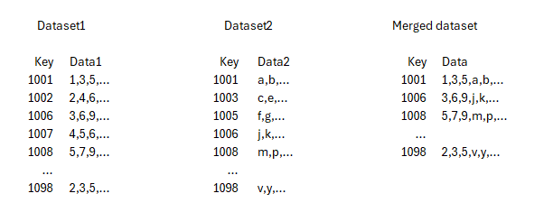
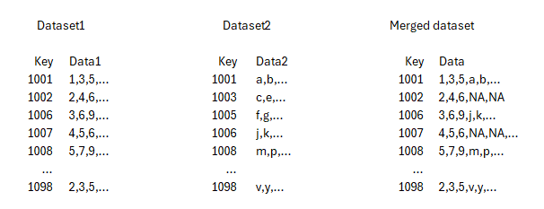
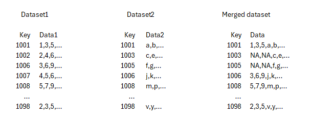
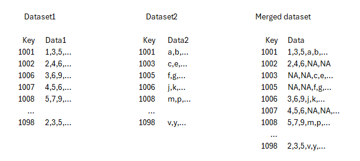
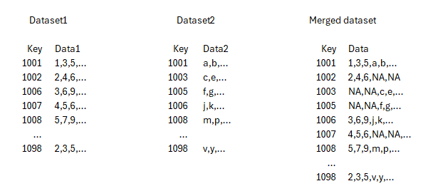
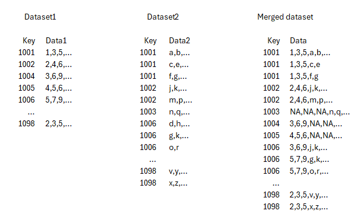
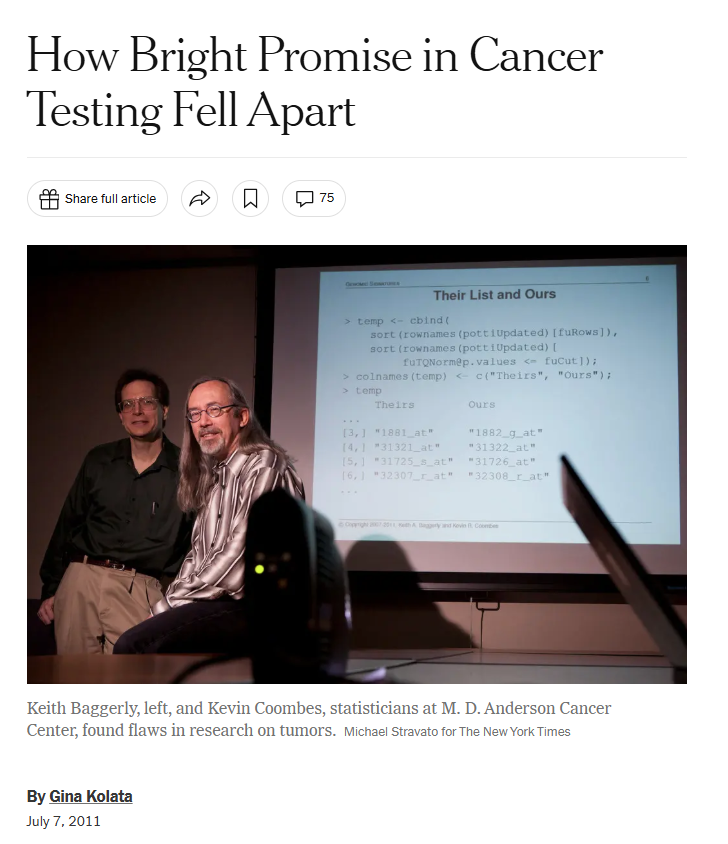
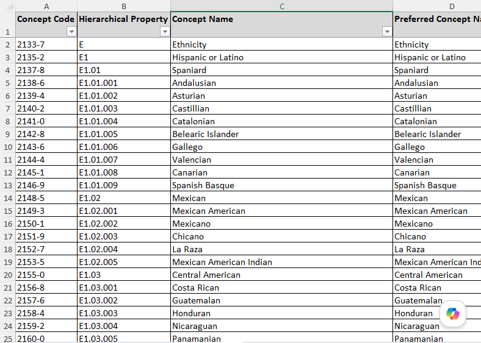

## Combining using set statement

-   `set first-dataset second-dataset`
    -   Stacks one beneath the other
    -   Variable names and types should match
    -   Number of rows do not have to match
    -   Can combine more than two datasets
    
::: {.notes}
You have already seen the set statement in previous code. If you specify two datasets with the set statement, SAS will stack one beneath the other. 

The variable names should match. Don't try this if one variable is one dataset is numbers and the variable with the same name in the other dataset is strings. 

If you have extra variables in one dataset, SAS will use missing values in the other dataset before stacking them. 

The number of rows do not have to match. The combined dataset will have a number of rows equal to the sum of the row numbers in the two datasets.

You can combine three or more datasets just by listing all their names in the set statement.
:::
    
## Combining datasets using merge statement (without a by statement)   

-   `merge first-dataset second-dataset`
    -   Stacks side-by-side
    -   Beware of misalignment
    -   Variable names should not match
    -   Number of rows should match
    
::: {.notes}

The merge statement works differently with and without a by statement accompanying it. Let's discuss the merge statement without a by statement first.

The merge statement will stack two datasets side by side. The variable names should not match (with the possible exception of a key which you will see later). This makes sense, if the variable names matched, then you would have two columns with the same variable name. SAS would not allow this and ends up using the duplicative column found in the second dataset.

If you don't have a by statement, you should probably try to insure that both datasets have the same number of rows. If there is a mismatch, SAS will pad the shorter dataset at the bottom with a bunch of missing values. Mismatch in the number of rows in a merge without a by statement is almost always a sign of trouble.
:::
    
## Using the by statement

-   `by key`
     -   Better way to handle mismatching row numbers
     -   The key controls the match
     -   Data MUST be sorted by key
     -   Could have two or more keys

::: {.notes}
The by statement informs SAS that you have a variable called the key that tells SAS how to match information from one dataset with information from the other dataset. In many datasets, a key represents an identification code for a particular patient or research subject.

If you have a mismatch in the row numbers, you almost always want to use a key. In a perfect world, the values of the key in one dataset will match the values of the key in the other dataset. In the real world, you will have cases where the keys do not line up perfectly and this may be a normal and expected part of the research.

There are several approaches in how you handle the mismatch.
:::

## Example of an inner join

::: {.notes}
In an inner join, all the mismatches are discarded. In this hypothetical example, you have data on the key for 1001, 1006, 1008, and 1098 in both data sets. These are included with an inner join. The keys 1002 and 1007 are found only in the first data set. The keys 1003 and 1005 are found only in the second dataset. None of these four mismatches, no matter what the direction of the mismatch, are included with the inner join.
:::

## Example of a left join

::: {.notes}
In a left join, all the records from the left (or first) dataset are included, even subjects 1002 and 1007 who are nowhere to be found in the second dataset. For those two subjects, you see missing values padded for the data2 variables. 

In simpler terms, the left join includes all the numbers data and supplements the letters data with missing values as needed.
:::

## Example of a right join

::: {.notes}
In a right join, all the records from the right (or second) dataset are included and that means key values of 1003 and 1005. Since these two keys are not found in the first dataset, SAS uses missing values.

Again looking at it simply, the right join includes all the letters data and supplements the numbers data with missing values as needed.
:::

## Example of a full or outer join

::: {.notes}
A full join or an outer join lets everyone into the party. The keys 1002 and 1007 are in and they supplement the letters with missing vlues. The keys 1003 and 1005 are also in and they supplement the numbers with missing values.

Now there is a mismatch that is left out of the full join. Key 1004, if it represents a real patient, is not found in dataset1 or dataset2. You will never know about that double mismatch unless you have a third dataset that includes key 1004.
:::

## Example of a one-to-one join

::: {.notes}
The joins we looked at so far--the inner join, left join, right join, and full join were all examples of one-to-one joins. Every row in the first dataset is either matched with only one record in the second dataset or it is padded with missing values. Every row in the second dataset is either matched with only one record in the first dataset or it is padded with missing values.

How you pad or don't pad with missing values depends on the type of join, but there is never a multiple match.
:::

## Example of a one-to-many join

::: {.notes}
Here is a one-to-many join. There is only one value for each key in dataset1, but it matches multiple key values in dataset2. In a one-to-many merge (or equivalently a many-to-one merge), the merged database includes multiple key values. Key 1001 has three rows in the merged dataset because there are three key 1001 vaue in dataset2. Key 1002 has two rows in the merged dataset because there are two key 1002 values in dataset2.

This is a full join so there is one row for the mismatches of 1003, 1004, and 1005.
:::

## The dangers of misalignment

::: {.notes}
Getting your dataset to match up with the merge statement, with or without a by statement is a treacherous task. It can be very easy to get the data misaligned and it is often difficult to notice this misalignment until it is too late.

The image here is from a New York Times article. It's copyrighted, but I am including it here under the fair use provisions of copyright law.

The article talks about a major scandal associated with a diagnostic test developed at Duke University. A research team developed a diagnostic test for patients with ovarian cancer. They used genetic signatures in your blood cells that could identify which among several competing cancer treatments is most likely to succeed with your particular cancer. Every cancer is different in how is responds to or is resistant to different drug treatments. The diagnostic test held out the hope that you could start each patient first on the drug mostly likely to succeed, rather than try the drugs in sequence, switching to a different drug when one drug wasn't working.

It sounds like a great idea, and a similar approach has been used with some success with breast cancer. Unfortunately, the analysis of the genetic signatures was botched. Two statisticians, Keith Baggerly and Kevin Coombes, noticed several problems with the analysis done by the Duke research team. This included a misalignment. The genes that were part of the genetic signature were not the genes that actually differed between patients responsive to drug A versus patients responsive to drug B. Instead the genes in the Duke profile were just a random jumble of genes and any recommendations of drug A versus drug B were not any better than a flip of a coin. 

There are several quality checks that you can run when you combine two datasets, and I recommend that you do some of these checks as part of your analysis routine. This could be be looking at the number of rows in the two original datasets and the merged dataset, looking for duplicate key values where none were expected, or comparing results from two different types of joins. There are others, which are dependent on the context of the particular data analysis.
:::

## When should you use a many-to-one join?

-   Very dependent on context
-   Adding labels to category codes
-   Adding time-varying data
-   Try to avoid many-to-many joins

::: {.notes}
It is not always obvious when you want/need a many-to-one join. It does depend a lot on the context of the problem. 

Adding labels is  a commen situation where a many-to-one join is needed. Your data table has a code for a particular category and you want to match that with a data table that has descriptive labels for each category code. There is only one value for each code and label, but many records in the first table could have the same category code. 

Time-varying data in a longitudinal or repeated measures data set is often merged with the time-constant data. For each single record in the time-constant data there are multiple matching records in the time-varying data.

Although there are a limited number of cases where you might have a many-to-many join where there are multiple matches on either side, this should generally be avoided. Instead you should try to segment your many-to-many joins with a sequence of many-to-one joins.
:::

## How should you choose between inner, left, right, and outer joins?

-   Also very dependent on context
-   Filling in gaps
-   Complete cases only

::: {.notes}
It is also difficult to decide amon the inner, left, right, and outer joins. This depends quite often on the context of the problem.

Sometimes you are using a join to fill in gaps in your data. You may have event counts for each date, but the dates without any events are not included in your data. You could do a right join with data listing all the values in the date range and then convert any mismatches to zero.

Sometimes you might want an analysis restricted to complete cases only and an inner join will insure that every variable needed in your model does not have missing data.
:::

## An example of a dataset with labels

::: {.notes}
This is a partial listing of an official CDC table on race/ethnicity. It has quite a bit of detail (over one thousand rows!), much of which may not be needed for your particular research study. That's why a left join of the original data with the CDC table makes sense. Everyone in the study stays in the study, even if their race/ethnicity code does not match one of the CDC codes. But codes in the CDC table that are not found in your database are not included.

It is also a many-to-one marge because multiple patients within your original table might have the same race/ethnicity code.
:::

