## The teletype

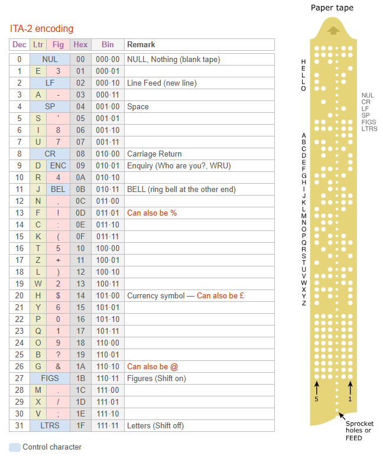

::: {.notes}
Everything that is stored in the computer is stored as a number. One of the earliest examples of this was the teletype machine. It used 5 bit code to represent 32 separate values. This could be expanded somewhat with the use of "Figures" and "Letters" codes that worked somewhat like the shift key on a computer keyboard.

Image found at https://www.cryptomuseum.com/ref/ita2/index.htm
:::

## EBCDIC, 1

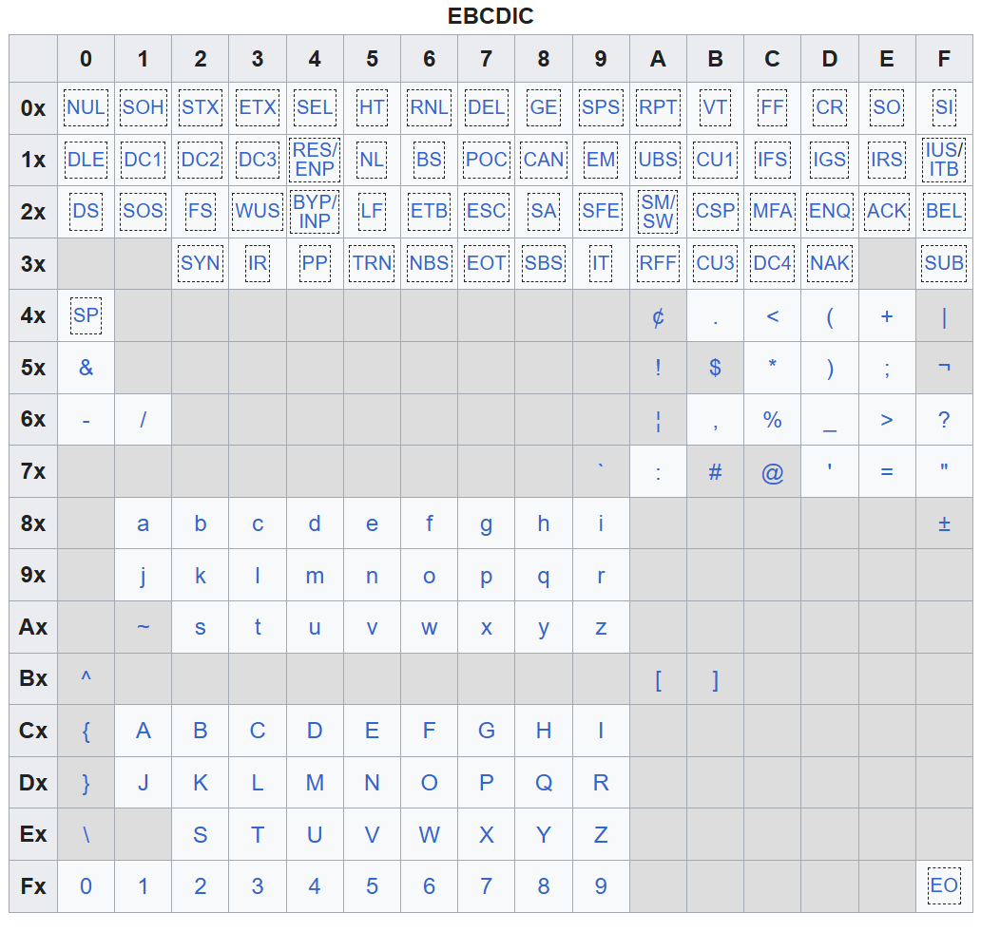

::: {.notes}
IBM mainframe computers used punched cards and coding system called EBCDIC, short for Extended Binary Coded Decimal Interchange Code. It is an eight-bit system, but left a lot of blank spots.`

https://en.wikipedia.org/wiki/EBCDIC
:::

## EBCDIC, 2

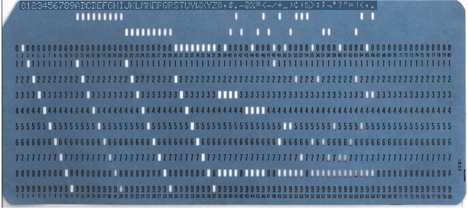

::: {.notes}
Here are the EBCDIC codes laid out on a punched card. The layout seems reasonably logical for the numbers 0 to 9 and the letters A to Z. One limitation of punched cards was the need to avoid more than three punched locations for any column. More than that would weaken the card and make it prone to tears.

https://en.wikipedia.org/wiki/EBCDIC
:::

## Seven bit ASCII

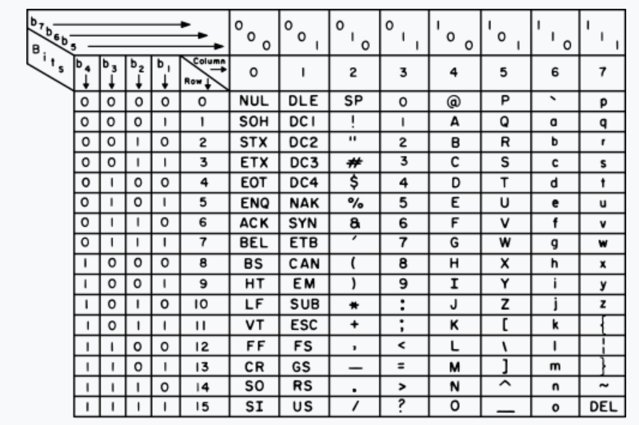

::: {.notes}
ASCII, short for American Standard Code for Information Interchange, came along shortly before the advent of microcomputers. It used 7 bits rather than 5 and handled upper and lower case very gracefully. It has a reasonable set of symbols. It is still missing a large number of letters that are needed in various European languages. 

Image found at https://en.wikipedia.org/wiki/ASCII
:::

## Eight bit ASCII, 1

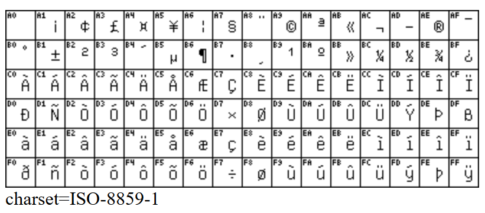

::: {.notes}
Most microprocessors at the time would pull out information in 8, 16, or 32 bytes. So programmers looked at the 128 characters in a 7 bit system and thought that you could switch to an 8 bit system, get a total of 256 characters, and not lose any speed or storage. So here is one example of the 8-bit extension to ASCII. This is iso-8859-1, also known as Latin-1. It includes the accent grave, the accent acute, the cedilla, the circumflex, the tilde, the diaresis, and other letter extensions that are needed for a variety of European languages.

Image found at https://www.marshallsoft.com/iso-8859.htm
:::

## Eight bit ASCII, 2

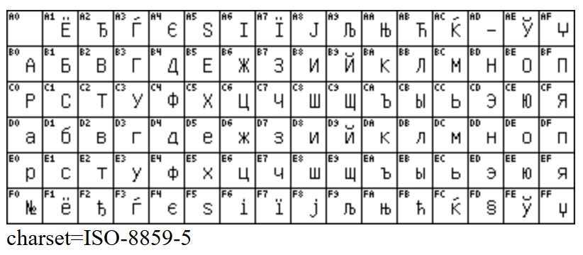

::: {.notes}
A different set of extensions was developed for our friends in Russia using letters from the Cyrillic alphabet.

Image found at https://www.marshallsoft.com/iso-8859.htm
:::

## Eight bit ASCII, 3

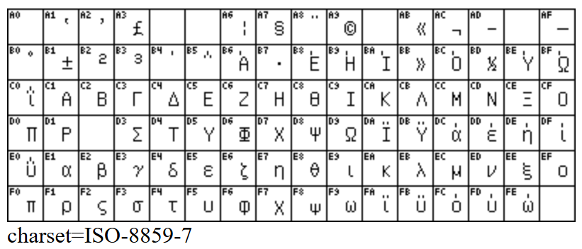

::: {.notes}
A third set of extensions was developed for our friends in Greece. Other 8 bit extensions helped with Hebrew, Arabic, and Nordic languages. All well and good, but there were two problems. First, if your computer thought a text file had Greek letters when it actually had Cyrillic letters, you would get gibberish. Second, certain languages required more than 8 bits. In particular, the CJK alphabets representing Chinese, Japanese, and Korean letters needed much more than 8 bits. The Chinese alphabet in particular, has over 40,000 characters.

Image found at https://www.marshallsoft.com/iso-8859.htm
:::

## Unicode to the rescue

::: {.notes}
In the early 1990s, a group of computer scientists developed the Unicode standard. This was originally a 16 bit system. Using 16 bits provided room for 65,536 characters. This was later extended to 1,112,064 characters, approximately 20 bits. Backward compatibility made it impossible to use an exact power of 2.

All of the CJK alphabet fits easily inside this limit and there is room emojis and for obsolete characters, such as hieroglyphics. Unicode has been a boon to many languages spoken by a dwindling population. It has provided a way for the few speakers of those languages to preserve their heritage.

Image found at https://en.wikipedia.org/wiki/Unicode
:::

## Some Unicode Latin characters

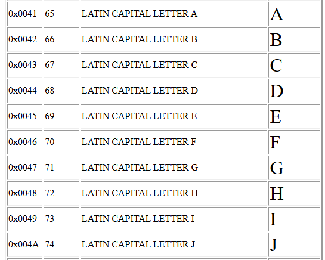

## Some Unicode modified Latin characters

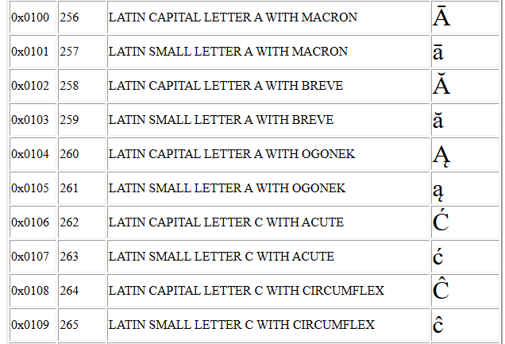

## Some Unicode Greek characters

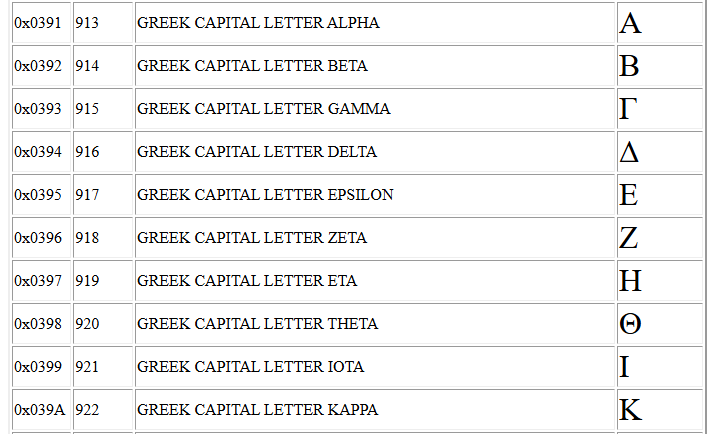

## Some Unicode Cherokee characters

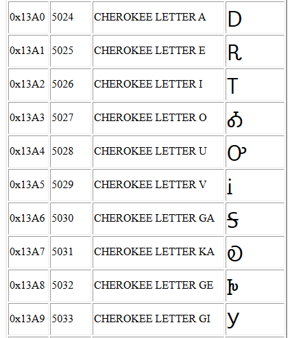

## Some Unicode Chinese characters

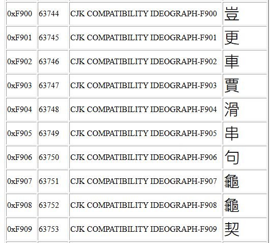

## UTF-8

-   Accommodates unicode characters
-   Maintains compatibility with 7-bit ASCII
    -   0xxx xxxx is a single byte
    -   1xxx xxxx is multiple bytes
        -   110x xxxx is two bytes
        -   1110 xxxx is three bytes
        -   1111 0xxx is four bytes
    -   Second, third, fourth bytes are 10xx xxxx

## Non-alphabetic Unicode

-   General punctuation
-   Arrows
-   Mathematical operators
-   Box drawing
-   Geometric shapes

## UTF-8 example 1

-   0100 0001
    -   Leading 0 means a single byte
    -   Remaining bits are 100 0001
    -   Equals decimal 65 or "A"

## UTF-8 example 2

-   1100 0100 1000 0001
    -   Leading 110 means two bytes
    -   Second byte must start with 10
    -   Remaining bits are 001 0000 0001
    -   Equals decimal 257 or "ā"

## UTF-8 example 3

-   1110 0001 1000 1110 1010 0011
    -   Leading 1110 means three bytes
    -   Second and third bytes must start with 10
    -   Remaining bits are 0001 0011 1010 0011
    -   Equals decimal 4096+512+256+128+32+2+1 or 5027 or "Ꭳ"

## Problems

-   Ligatures
-   Non-breaking space
-   Smart or curly quotes
-   Dashes (em and en)
-   Mojibake
